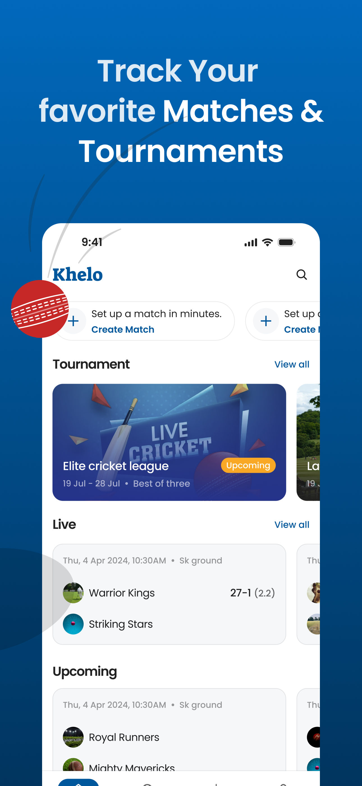
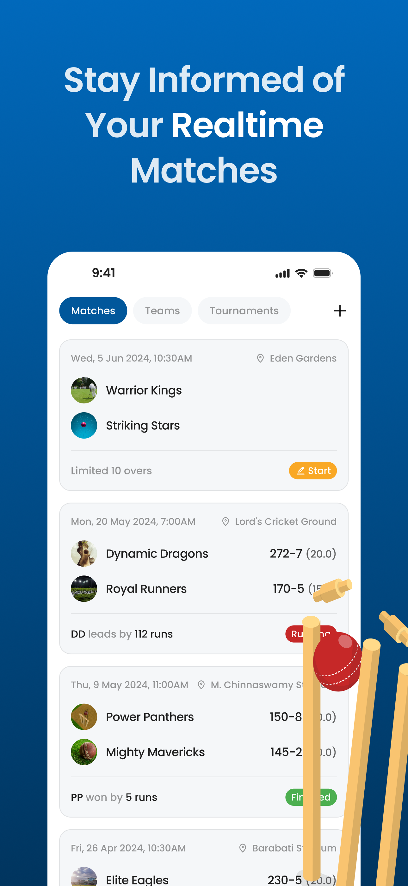
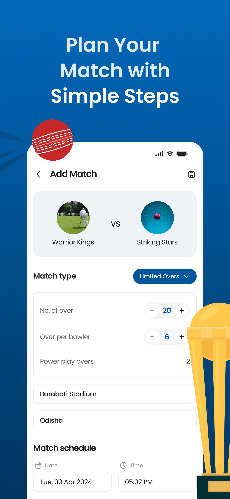

<p align="center"> <a href="https://canopas.com/contact"></a></p>

# Khelo - From Streets to Stadiums 🏏
**Your Ultimate Companion for Cricket Management**


## Overview
Welcome to Khelo, an open-source multi-platform app designed to cater to all your cricket needs, whether you're a cricket enthusiast, a team manager, or a player. With a wide array of features, our app simplifies the management of cricket teams, players, matches, and performance records. It's like having a personal assistant for your team!

Khelo is built using Flutter and Dart, leveraging Firestore for database management and Firebase for authentication. This project employs Riverpod as its state management solution, adhering to a clean architecture approach organized into multiple modules.

## Download App

<a href="https://play.google.com/store/apps/details?id=com.canopas.khelo"></a>
<a href="https://apps.apple.com/us/app/khelo/id6480175424"></a>

## Screenshots
<table>
  <tr>
    <th width="32%">Matches Record</th>
    <th width="32%">Teams List</th>
    <th width="32%">Start New Match</th>
  </tr>
  <tr>
    <td></td>
    <td></td>
    <td></td>
  </tr>  
</table>

<table>
  <tr>
    <th width="32%">Score Board</th>
    <th width="32%">Commentary</th>
    <th width="32%">Squad</th>
  </tr>
  <tr>
    <td></td>
    <td></td>
    <td></td>
  </tr>  
</table>

## Features 🌟🌟

- **Profile Management**: Effortlessly create and manage profiles for players, coaches, and team managers.
- **Team Creation**: Form your dream team by easily adding players and managing team compositions.
- **Player Management**: Keep track of player statistics, performance history, and personal information.
- **Match Data Recording**: Record detailed match data, providing a comprehensive overview of scores, wickets, and custom metrics.
- **Performance Tracking**: Analyze player performance over time for informed decision-making.
- **Team Statistics**: Gain insights into team performance through comprehensive statistical analysis and reporting.
- **Toss Details**: Document toss results, including winning teams and choices, for improved match analysis.
- **Tournament Feature**: Organize and track cricket tournaments with ease, right from the app.

> **Note**: Khelo is currently in active development 🚧, with plans to introduce additional features soon!

## Requirements ✅

<details>
<summary> Click to expand </summary>
<br>

**Khelo** requires the following to function properly:

**Software:**

- **Flutter**: [Download Flutter](https://flutter.dev/docs/get-started/install) (version: 3.24 or higher)
- **Dart**: Installed as part of the Flutter SDK (version: 3.5 or higher)
- **Firebase**: A free Google service offering various backend functionalities. (See [Firebase documentation](https://firebase.google.com/docs) for setup instructions)

**Additional Requirements:**

- A **Google account** to create a Firebase project.
- An **active internet connection** for Firebase communication.

**Platform-Specific Requirements:**

- **Android (if targeting Android):**
  - An Android device or emulator for development and testing.
  - Android Studio (optional, but recommended) for development: [Download Android Studio](https://developer.android.com/studio)

- **iOS (if targeting iOS):**
  - A Mac computer with Xcode installed for development and testing.

**Optional (for development and testing):**

- **Firebase CLI**: Simplifies managing Firebase projects locally. (See [Firebase CLI documentation](https://firebase.google.com/docs/cli))

</details>

## Technologies Stack 📚

Khelo leverages modern Flutter development technologies, adhering to industry best practices. Below is our current technology stack:

- **MVVM Architecture**: A design pattern that separates the user interface from business logic, enhancing testability.
- **Flutter**: A UI toolkit for building natively compiled applications.
- **Dart**: The programming language used to write Flutter apps.
- **Http & Dio**: Libraries for making network requests.
- **GoRouter**: A declarative routing package for Flutter.
- **RiverPod**: A state management solution that is simple and powerful.
- **Firebase Authentication**: For secure user authentication.
- **Firebase Firestore**: A scalable database for storing app data.
- **Cloud Functions**: To run backend code in response to events triggered by Firebase features.

## Contribution 🤝
The Canopas team enthusiastically welcomes contributions and project participation! There are a bunch of things you can do if you want to contribute! The [Contributor Guide](CONTRIBUTING.md) has all the information you need for everything from reporting bugs to contributing entire new features. Please don't hesitate to jump in if you'd like to, or even ask us questions if something isn't clear.

## What's Coming Next? 🚀

- **Live Streaming**: Watch live matches directly through Khelo as we introduce live streaming, making it easier to follow your favorite teams and matches in real time.
- **Voice-Over Scoring**: Get an immersive cricket experience with voice-over scoring, providing live commentary and score updates as the game unfolds.
- **Improve User Experience**: We're continuously working on improving the user experience, with plans to incorporate additional features and enhancements shortly.

## Feedback & Suggestions ✨

We welcome and appreciate any suggestions you may have for improvement. For bugs, questions, and discussions, please use the [GitHub Issues](https://github.com/canopas/khelo/issues).

## Credits 💻
Khelo is owned and maintained by the [Canopas team](https://canopas.com/).

You can follow them on Twitter at [@canopas_eng](https://x.com/canopas_eng) for project updates and releases. If you are interested in building apps or designing products, please let us know. We'd love to hear from you!

<a href="https://canopas.com/contact"></a>

## Licence 📄

**Khelo** is licensed under the Apache License, Version 2.0.

```
Copyright 2024 Canopas Software LLP

Licensed under the Apache License, Version 2.0 (the "License");
You won't be using this file except in compliance with the License.
You may obtain a copy of the License at

http://www.apache.org/licenses/LICENSE-2.0

Unless required by applicable law or agreed to in writing, software
distributed under the License is distributed on an "AS IS" BASIS,
WITHOUT WARRANTIES OR CONDITIONS OF ANY KIND, either express or implied.
See the License for the specific language governing permissions and
limitations under the License.
```


