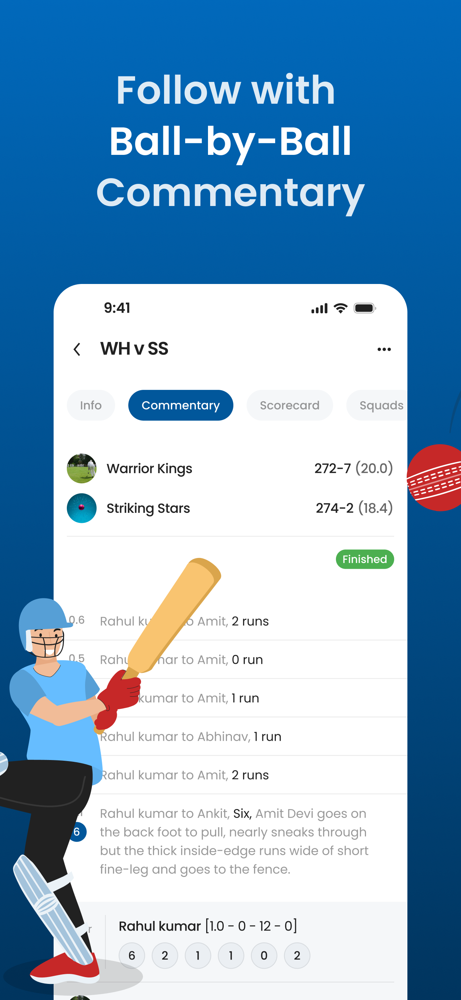

<p align="center"> <a href="https://canopas.com/contact"></a></p>

# Khelo- From Streets to Stadiums🏏
Khelo - an open-source ultimate companion for all things cricket!


## Overview
Welcome to Khelo, an open-source multi-platform app designed to cater to all your cricket needs, whether you're a cricket enthusiast, a team manager, or a player. With a wide array of features, our app simplifies the management of cricket teams, players, matches, and performance records.
It's like having a personal assistant for your team!

Khelo is an open-source Flutter project written in Dart using Firestore database, Firebase authentication, and cloud firestore. This project uses Riverpod as state management library and it adapts clean architecture approach, organized into multiple modules.

## Download App

<a href= "https://play.google.com/store/apps/details?id=com.canopas.khelo"></img> <a href="https://apps.apple.com/us/app/khelo/id6480175424"></img>

## Screenshots
<table>
  <tr>
  <th width="32%" >Matches Record</th>
  <th  width="32%" >Teams List</th>
   <th  width="32%" >Start New Match</th>
  </tr>
    <tr>
  <td></td>
  <td>  </td>
  <td>  </td>
  </tr>  
</table>

<table>
  <tr>
  <th width="32%" >Score Board</th>
  <th  width="32%" >Commentary</th>
   <th  width="32%" >Squad</th>
  </tr>
    <tr>
  <td></td>
  <td>  </td>
  <td>  </td>
  </tr>  
</table>


## Features 🌟🌟

- **Profile Management**: Create and manage profiles for players, coaches, and team managers effortlessly.
- **Team Creation**: Form your dream team by adding players and managing team compositions with ease.
- **Player Management**: Keep track of player details, including statistics, performance history, and personal information.
- **Match Data Recording**:  Record detailed match data, including scores, wickets, runs, and other custom metrics, providing a comprehensive overview of each game.
- **Performance Tracking**:  Monitor and analyze player performance over time, enabling informed decision-making and strategic planning.
- **Team Statistics**: Gain insights into team performance through comprehensive statistical analysis and reporting tools.
- **Toss Details**: Record toss details, including which team won the toss and their choice, enhancing match documentation and analysis.

 > **Note**: Khelo is currently in active development🚧, with plans to incorporate additional features shortly.


## Feedback and Suggestions

For bugs, questions and discussions please use
the [Github Issues](https://github.com/canopas/khelo/issues)


## Credits
Khelo is owned and maintained by the [Canopas team](https://canopas.com/). You can follow them on Twitter at [@canopassoftware](https://twitter.com/canopassoftware) for project updates and releases. If you are interested in building apps or designing products, please let us know. We'd love to hear from you!

<a href="https://canopas.com/contact"></a>


## Licence 📄

**Khelo** is licensed under the Apache License, Version 2.0.

```
Copyright 2024 Canopas Software LLP

Licensed under the Apache License, Version 2.0 (the "License");
You won't be using this file except in compliance with the License.
You may obtain a copy of the License at

http://www.apache.org/licenses/LICENSE-2.0

Unless required by applicable law or agreed to in writing, software
distributed under the License is distributed on an "AS IS" BASIS,
WITHOUT WARRANTIES OR CONDITIONS OF ANY KIND, either express or implied.
See the License for the specific language governing permissions and
limitations under the License.
```


